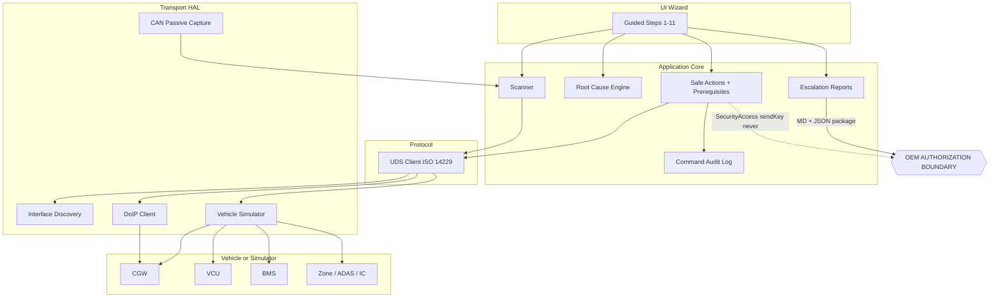

# Architecture Diagram

```mermaid
flowchart TB
  subgraph UI["UI Wizard"]
    W[Guided Steps 1-11]
  end

  subgraph App["Application Core"]
    S[Scanner]
    R[Root Cause Engine]
    A[Safe Actions + Prerequisites]
    E[Escalation Reports]
    AUD[Command Audit Log]
  end

  subgraph Proto["Protocol"]
    UDS[UDS Client ISO 14229]
  end

  subgraph HAL["Transport HAL"]
    DISC[Interface Discovery]
    DOIP[DoIP Client]
    CAN[CAN Passive Capture]
    SIM[Vehicle Simulator]
  end

  subgraph Vehicle["Vehicle or Simulator"]
    CGW[CGW]
    VCU[VCU]
    BMS[BMS]
    OTHER[Zone / ADAS / IC]
  end

  W --> S
  W --> R
  W --> A
  W --> E
  S --> UDS
  A --> UDS
  A --> AUD
  UDS --> DISC
  UDS --> DOIP
  UDS --> SIM
  CAN --> S
  DOIP --> CGW
  SIM --> CGW
  SIM --> VCU
  SIM --> BMS
  SIM --> OTHER

  AUTH{{OEM AUTHORIZATION BOUNDARY}}
  A -.->|SecurityAccess sendKey never| AUTH
  E -->|MD + JSON package| AUTH
```
